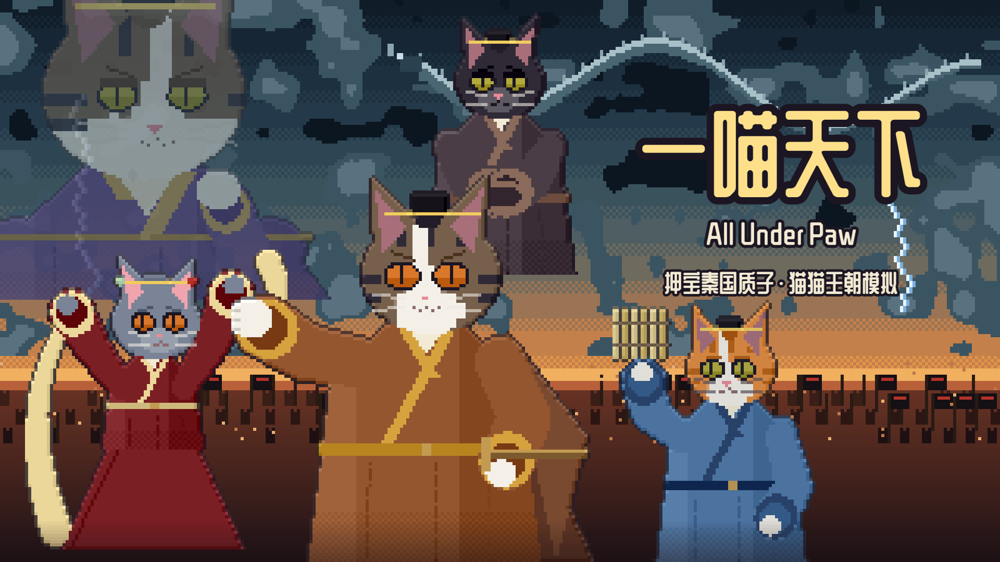

# 一喵天下 All Under Paw

战国末年，一只邯郸小商猫押宝秦国质子，摄政、篡位、一统天下。猫猫版家族王朝模拟（CK 式）。

**在线试玩：** https://grrreymane.github.io/AllUnderPaw/

## 怎么玩

- 前 262 年，邯郸。你是狸家的新家主，和大商人吕不韦抢着押宝秦国落魄质子「异人」。
- 每季有 2 点精力：经商、结交、遣使咸阳、办主公派的差事……目标行永远告诉你下一步。
- 点任何一只猫看详情：交谈、送礼（鱼干或名物）、提亲、求教、求助，或者勾引、构陷、离间、握把柄。
- 太阁式往上爬：办差事攒功，从商贾做到舍人、客卿、相邦、仲父，甚至秦王；属性越用越强，可以拜名师；置产业、收名物；关键时刻舌战、比剑。
- CK 式家族剧：成亲、生崽、分户、立嗣、摄政；毛色按真实的猫遗传学遗传，私生子的毛色可能露馅；心烦、生病、挚友、宿敌、门下四席。
- 家主老去后，选一只崽接班。任何结局都不是终点，狸家一直往下传。
- 点目标行旁的「›」，看眼下为什么要做这件事，再直接前往对应地点。「近况」和右上角「?」里可以打开狸家纪事，回看历任家主、关键选择和灭国之功。
- 重要剧情会展开 CG，点击「继续剧情」再做选择；「? → 画卷图鉴」可以重看已经经历的画面。人物卡上的「查看立绘」可打开全身像。

## 剧情美术

以封面为参考，用 LightAI 生成并切分了 **16 张 CG** 和 **78 张透明立绘**（70 位历史人物、狸家三兄妹，以及 5 个年龄/服装版本）。CG 为 1280×720，立绘为 384×512，配套头像为 192×192，均为本地 WebP 素材，按需加载。

新开局固定长子的狸花白、次女的狸花白、幼子的橘虎斑。赵姬与吕不韦、狸家次女与子楚两条路线的政使用双方都能合法遗传的固定混血外观：深棕虎斑、少量口鼻和下巴白毛、金眼。赵姬带孕嫁子楚时保留已有生父和预产期，没有受孕记录才采用吕不韦的默认前史。与玩家有血缘关系的政也使用现成立绘，但其他亲本组合的实际基因不会为了套图被改写。赵姬嫁给玩家时，历史事件不转嫁她、不把普通孩子变成政。

5 张相关立绘及 8 张 CG 已按这组外观重绘。旧档保留已经出生角色的原始基因和血缘；与玩家有血缘关系的政同样复用现成立绘，其他不匹配的旧角色继续程序绘制。图片加载失败仍能继续剧情，回看不重复结算事件。美术批次、触发节点及维护方式见 [美术记录](docs/art-log.md)。

## 预设剧本

后期剧本直接加载固定前史，不再在选择时自动经营和逐项代选。预设中赵姬嫁子楚，狸家次女没有被代为送嫁；仲父时期由吕不韦掌权，狸家以客卿身份开始。六国归秦时间采用项目历史年表，前221年统一；前209年胡亥在位。进入之后仍可改变后续历史。

| 剧本 | 起始小鱼干 | 狸家身份 |
| --- | ---: | --- |
| 前257年 · 入秦 | 300 | 舍人 |
| 前247年 · 仲父 | 450 | 客卿 |
| 前237年 · 一统 | 600 | 客卿 |
| 前221年 · 尾声 | 600 | 客卿 |
| 前209年 · 乱世 | 800 | 在野 |

预设不解锁未亲历 CG，不把准备阶段的选择写入玩家纪事；每次重新选择都会得到独立开局。预设快照在 `src/scenario-presets.js`，维护工具 `tools/build-scenarios.js` 只在开发时离线制作前史，发布运行时不会调用。

## 存档

完成行动、事件选择和换季后自动保存；尚未完成的多步选择、舌战和比剑结束后再保存。每次进入新的一季，会保留上一季的完整进度作为备份。

标题页左上角「存档」、游戏内左上角日期和右上角「? → 存档」都能打开存档页：

- **导出当前存档**：下载一份 JSON 文件，可留底或换设备继续。
- **导入存档文件**：先检查文件并显示家主、年份；确认后载入，原来的进度保留为备份。
- **恢复备份**：当前档读不出来时，可从标题页恢复。恢复前也会保留当前可用的进度。
- 保存失败会出现提示，日期下方显示红线；此时可导出正在玩的进度，或在存档页重试保存。

清理浏览器数据会同时移除当前档与本机备份，建议定期导出。旧版原始存档和新版导出文件均可导入；未来版本或损坏文件会被拒绝。

## 内容

- 第一幕「奇货」（邯郸）：上党、吕府夜宴、美姬之谜、长平、邯郸之围、窃符救赵、出城
- 第二幕「仲父」（咸阳朝堂）：随公子入秦 / 留在邯郸 / 做赵国人，四条路；朝堂席位、拜相、仲父、太后与嫪毐、成峤、冠礼之夜、清算，五种结局
- 第三幕「一统」：六国一个个倒下；出征、离间、结好、劝降；荆轲、六十万、称帝
- 尾声到前 206 年；大泽乡之后可以自立，和项羽、刘季争天下（楚汉）
- 自由模式：家族志向、子女出路、迁居

## 本地运行

整个游戏是一个 `index.html`，没有构建步骤，直接用浏览器打开即可（或 `python -m http.server` 后访问）。进度保存在浏览器本地存储里。

## 开发与验证

游玩仍无需构建或安装依赖。家族纪事、存档及剧情美术逻辑维护在 `src/`；`src/art-manifest.js` 是图片目录。改完运行 `npm run sync`，同步到 `index.html` 的对应标记区。其余现有逻辑仍在 HTML 中。不要直接修改标记内的生成区。

`npm test` 使用 Node.js 18+，无需安装依赖。测试直接读取当前 `index.html`，检查源文件是否同步，并以三个固定种子覆盖六个剧本、260 季推进、继承、旧档迁移、存储失败、导入和备份恢复，以及固定花色、CG 分支/暂停/回看、图片完整性，不依赖 `_test.html` 副本。

`npm run test:browser` 是可选的真实浏览器检查，需要可用的 Playwright 和 Chromium。可用 `PAW_PLAYWRIGHT` 指定已有 Playwright 包路径、`PAW_BROWSER` 指定浏览器可执行文件。它使用独立临时会话，检查导出下载、导入确认、损坏存档恢复、待选事件刷新及 320px 手机界面；截图保存在忽略提交的 `.test-output/` 中。

改了游戏里的文字后运行 `python D:/Minigame/_workflow/tools/subset_font.py .` 更新字体子集。

设计稿见 `DESIGN.md`，史料 / 视觉 / 遗传学资料见 `docs/`。
