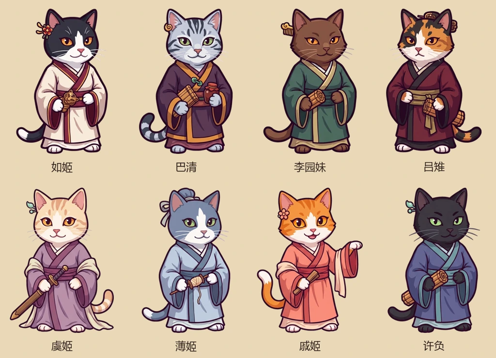

# 女性人物与寻访（2026-10-03）

新增如姬、巴清、李园妹、吕雉、虞姬、薄姬、戚姬、许负，配备独立立绘、头像、生平和各自的结识事件。沿用原有纸质人物卡、列表、选人、事件与提亲系统。

## 怎么遇见

「人 → 寻访」列出登场年份、所在地、配偶状态；点人物打开人物卡，同城后在「友」类行动中选择「登门结识」，可以自己赴约，也可以指定同城的成年家人。未登场者可以先读生平。换季时新人物的到来会写入近况。

下表年龄、登场年与可访问城市为游戏安排，不能据此推定历史人物生卒年。所有新增人物在首次登场时至少十八岁。

| 人物 | 登场／年龄 | 结识地点 | 主题与外形 |
| --- | --- | --- | --- |
| 如姬 | 前262年／24岁 | 大梁 | 践诺报恩；黑白猫、红白衣、虎符 |
| 巴清 | 前262年／20岁 | 蜀 | 丹砂生意；银虎斑、紫褐衣、账簿和陶罐 |
| 李园妹 | 前250年／20岁 | 邯郸；前238年后首次补入则在大梁 | 谋划退路；巧克力猫、青衣、竹简 |
| 吕雉 | 前223年／18岁 | 大梁 | 持家安排；三花、绛衣、沉稳表情 |
| 虞姬 | 前214年／18岁 | 大梁 | 乱世相伴；奶油虎斑、浅紫衣、佩剑 |
| 薄姬 | 前212年／18岁 | 大梁 | 不忘旧交；蓝白猫、淡青衣、线束 |
| 戚姬 | 前212年／18岁 | 河南 | 听曲识意；橘白猫、珊瑚衣、拍板 |
| 许负 | 前211年／18岁 | 河南 | 察言观行；黑猫、靛青衣、竹简 |

一次结识花1点精力：按赴约者能力交谈，成功获得对方好感+12、未成+3；或另花30鱼干备礼，获得好感+10。同一双方每四季可拜访一次；取消不收费。好感记在实际赴约的家人身上。普通交谈、送礼、示好等行动仍然可用。

同城、可婚配的新增女性会进入原来的家人婚配候选列表。结识不会自动建立恋人或配偶关系，提亲仍检查原系统的年龄、亲缘、婚姻与身份条件。巴清的产业不随成婚免费转移；名人的后代没有额外指定身份或奖励。

## 历史前史与玩家分支

如姬首次登场保留魏安釐王关系。首次补入人物时，若开局年份已经进入对应前史，且双方没有既有婚姻、恋人、子女、怀孕、狸家身份或对玩家的正面私人关系，则补入李园妹与楚考烈王、吕雉与刘季、虞姬与项羽、薄姬与魏豹的背景婚配。这里只用原系统的一对配偶关系概括宫廷关系，并非声称历史宫廷实行一夫一妻。

这些关系只在新角色首次补入时建立。人物进入本局后，不会到某一年强行出嫁，也不会抢走玩家或家人的配偶；后续采用本局实际关系。相应人物的婚期多无确年，代码中的开始年是预设前史界线，不作史实断言。已过所设相遇时期的角色不再补生；已故角色不复活。

旧存档只补当时尚未存在的角色，已有角色的基因、关系、孩子、怀孕和生父记录原样保留。特殊花色只用于创建这些历史人物；孩子仍使用双方实际基因遗传、普通姓名和普通外形，不会被自动改成刘恒、如意或楚王。赵姬与政的既有分支不作改动。

## 史料与改编边界

- 如姬的魏王关系、父仇与取符见[《史记·魏公子列传》](https://ctext.org/shiji/wei-gong-zi-lie-zhuan/zhs)。生年和游戏初始年龄是改编。
- 巴寡妇清的丹砂家业、以财自卫和秦始皇礼遇见[《史记·货殖列传》原文摘录（名古屋大学）](https://toyoshi.lit.nagoya-u.ac.jp/maruha/siryo/shiji129.html)。巴是地望；二十岁掌家、可再婚和具体相遇是玩法安排。
- 李园妹的身份及与春申君、楚考烈王的关系见[《史记·春申君列传》](https://ctext.org/shiji/chun-shen-jun-lie-zhuan/zh)。不用没有可靠依据的个人名字；旅居、年龄和衣饰为改编。
- 吕雉的早年婚姻和汉初事迹见[《史记·吕太后本纪》](https://wenku.github.io/shiji/zh-tw/009.html)。在大梁相遇、成年出场年及具体婚期界线为游戏安排。
- 虞姬在项羽身边随行的记载见[《史记·项羽本纪》](https://ctext.org/shiji/xiang-yu-ben-ji)。生年、早年游历和佩剑造型没有当作史实；游戏不强制安排她的死法。
- 薄姬、戚夫人及许负相薄姬的记载参见[《史记·外戚世家》](https://www.shidianguji.com/zh/book/HY2295/chapter/1kw42qtygw376)。许负又见《三国志》注引《汉魏春秋》的河内温县妇人记载。年龄与早年相遇均作改编，许负的能力设计不保证预言成真。

## 维护与验证

规则在 `src/story/historical-women.js`，图片目录在 `src/data/art-manifest.js`；使用 `npm run sync` 嵌入发布 HTML。立绘384×512、头像192×192，脸部裁切逐张记录于 `art/face-crops.json`。固定外观只在创建时赋值。

`tests/historical-women.js` 覆盖八人入场边界、五个晚期预设、原婚配入口、指定家人好感、付费和重复回调、失效预约、婚后出生与真实遗传、旧档和玩家关系保护。浏览器套件检查寻访、立绘、赴约、生平以及320px手机界面。
